<h1 align="center">Hi, I'm Iker 👋</h1>

  Full-Stack Developer · React · TypeScript · Next.js · Node.js · Python · Docker · React Native 
  <i>Building things that scale. Breaking them to understand why.</i>

---

### About me

I'm a full-stack developer with 3+ years of experience building modern web applications. I work across the entire stack — from React/TypeScript frontends to Node.js backends, Python scripts, and containerized deployments with Docker.

I care about clean code, developer experience, and shipping things that actually work in production.

- 🌍 Based in Brazil, open to remote roles worldwide
- 💼 3+ years of professional experience
- 📱 Building cross-platform apps with React Native + Expo
- 🧪 Advocate for testing culture (Vitest + Testing Library)
- 💬 Happy to chat about React architecture, TypeScript patterns or system design

---

### Tech stack

**Frontend**

**Backend**

**Mobile**

**Infra & tooling**

---

### GitHub stats

  

---

### Let's connect

  
  &nbsp;
  
  &nbsp;
  <!-- Optional: add your portfolio link -->
  <!--  -->

