<h1 align="center">Hi, I'm Iker 👋</h1>

  Full-Stack Developer · React · TypeScript · Next.js · Node.js · Python · Docker · React Native 
  <i>Building things that scale. Breaking them to understand why.</i>

---

### About me

I'm a full-stack developer with 3+ years of experience building modern web applications. I work across the entire stack — from React/TypeScript frontends to Node.js and Python backends, mobile apps with React Native, and containerized deployments with Docker.

I care about clean code, developer experience, and shipping things that actually work in production.

- 🌍 Based in Brazil, open to remote roles worldwide
- 🤖 Building AI-powered tools — RAG pipelines, LLM integrations with the Claude API
- 📱 Cross-platform apps with React Native + Expo + Supabase
- 🧪 Advocate for testing culture (Vitest + Testing Library)
- 💬 Happy to chat about React architecture, TypeScript patterns or system design

---

### Tech stack

  

  

---

### Featured projects

| Project | What it does | Stack |
|---|---|---|
| [CodeReviewer](https://github.com/ikergoncalves/CodeReviewer) | AI-powered code reviewer with real-time streaming and line-by-line issue detection | React · TypeScript · Claude API |
| [StreakSync](https://github.com/ikergoncalves/StreakSync) | Offline-first habit tracker with real-time social accountability | React Native · Expo · Supabase |
| [SplitLedger](https://github.com/ikergoncalves/SplitLedger) | Async expense-splitting backend with automatic debt simplification | Python · FastAPI |
| [RAG](https://github.com/ikergoncalves/RAG) | Retrieval-augmented generation with clickable citations | Python |
| [chiselui](https://github.com/ikergoncalves/chiselui) | Precisely chiseled React component library | React · TypeScript |

---

### GitHub stats

  
  

---

### Let's connect

  
  &nbsp;&nbsp;
  

